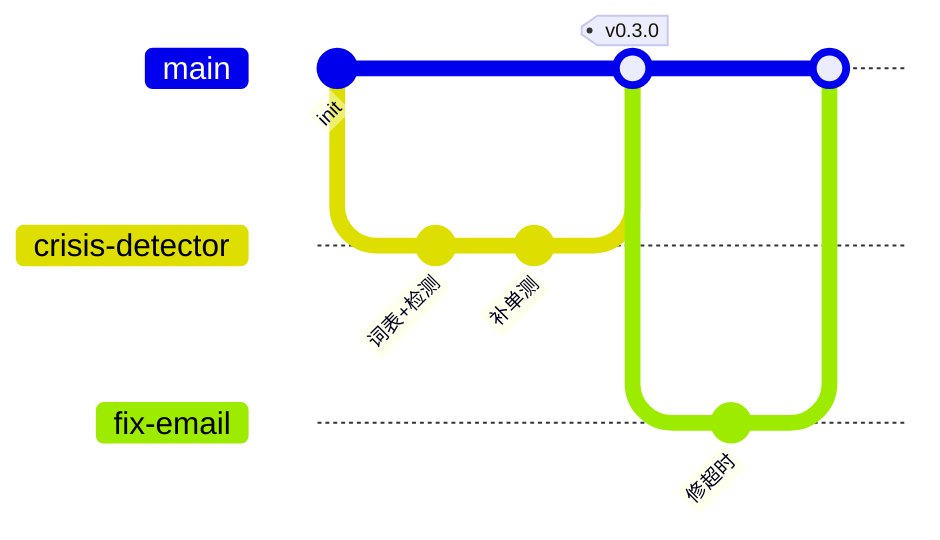

# LIGHTCLOUDMASTER 开发规范（精简版）

## 0. 工作区约定

**一切操作仅在本地工作区 `E:\LightCloudMaster20260910` 内进行**：克隆、编码、提交、测试、构建、文档与数据读写、Checkpointer 与日志产物，均不得超出该目录及其子目录。

| 规则 | 说明 |
|---|---|
| 唯一工作区 | 仓库、文档、测试数据、`.venv`、checkpoints、日志统一收敛于 `E:\LightCloudMaster20260910` |
| 禁止跨区操作 | 禁止在其他盘符/目录执行 git 命令、运行脚本或读写项目文件；IDE 与终端的项目根必须指向该目录 |
| 相对路径优先 | 代码与脚本一律以仓库根为基准使用相对路径；确需绝对路径时从环境变量/配置读取，禁止在代码中硬编码 `E:\` |
| 开工前校验 | 每日开工先执行 `git rev-parse --show-toplevel`，确认输出为 `E:/LightCloudMaster20260910` 再继续操作 |
| 迁移 | 换机或迁移时整目录打包迁移，迁移后先跑 `make pre` 验证再继续开发 |

原因：统一工作区可避免误操作其他项目目录、防止 `.env` / 用户数据 / 数据库文件散落（§1.5 / §1.7），并保证 ignore 规则与相对路径配置一致生效。

## 1. Git 版本控制规范

### 1.1 分支模型



| 分支 | 用途 | 规则 |
|---|---|---|
| `main` | 可运行版本 | 禁止直接 push / force push；只接受 PR 合并；发版打 tag |
| `feature/编号-短名` | 新功能 | 从最新 `main` 拉出，合并后删除 |
| `fix/编号-短名` | 缺陷修复 | 同上 |
| `hotfix/短名` | 紧急修复 | 从 `main` 拉出，修完立即合回并补 tag |

团队 5 人以内，不设 develop 分支：`main` 即集成分支，质量靠 PR 自测门禁（见 §2）保证。

### 1.2 分支命名

格式：`类型/issue编号-小写短横线短名`

| 示例 | 含义 |
|---|---|
| `feature/12-crisis-detector` | issue #12：危机词表检测 |
| `fix/18-email-timeout` | 邮件工具超时修复 |
| `hotfix/login-500` | 线上登录报错紧急修复 |

### 1.3 Commit 信息规范（Conventional Commits）

一行式：`<type>(<scope>): <做了什么>`

| type | 用于 |
|---|---|
| `feat` | 新功能 |
| `fix` | 缺陷修复 |
| `docs` | 文档 |
| `test` | 测试 |
| `refactor` | 重构（不改变行为） |
| `chore` | 依赖 / 配置 / 杂务 |

scope 建议：`agent` / `tools` / `prompts` / `rag` / `api` / `ci` / `docs`。

示例（可直接模仿）：

```
feat(tools): 新增邮件报告工具，带超时与失败重试
fix(graph): 修复条件边缺省值导致的死循环
test(crisis): 补充 20 条高危语料回归用例
docs: 更新 README 自测命令
chore(deps): 锁定 langgraph 版本
```

规则：一个 commit 只做一件事；为什么改写在正文（可选）；禁止 `update`、`fix bug` 这类无信息提交。

### 1.4 合并流程（PR）

1. push 到自己的分支（下班前必须 push，作备份）。
2. 开 PR：标题同 commit 格式；正文必须附**自测结果摘要**（§2.1 命令输出）。
3. 至少 1 人 approve；涉及危机识别 / 用户数据的改动需 2 人。
4. squash merge 回 `main`，保证 `main` 上每条记录对应一个完整功能。
5. 合并后删除远端分支。

### 1.5 .gitignore 必备项

```gitignore
# 密钥与环境
.env
.env.*
!.env.example

# 运行数据（严禁入库）
*.sqlite3
checkpoints/
logs/
data/private/

# Python
__pycache__/
.venv/
*.egg-info/
dist/
.pytest_cache/
.mypy_cache/
.ruff_cache/
```

### 1.6 版本号与 tag

- 语义化版本 `vMAJOR.MINOR.PATCH`，tag 只打在 `main` 上。
- `v0.1.0` = 最小闭环跑通；此后每完成一个里程碑递增 0.1。
- 命令：`git tag -a v0.3.0 -m "危机干预链路完整" && git push origin v0.3.0`

### 1.7 红线（违反即回退提交）

- 禁止向 `main` 直接 push 或 force push。
- 禁止提交 API key、`.env`、用户对话数据、数据库文件、构建产物。
- 禁止提交大于 10MB 的文件。
- 密钥一旦泄露：立即作废并轮换密钥 → 清理 git 历史 → 全组通报。
- 禁止在工作区 `E:\LightCloudMaster20260910` 之外执行任何 git / 构建 / 数据操作。

---

## 2. 自行测试规范

### 2.1 提交前最小闭环（不绿不 push）

```bash
ruff check . && ruff format --check .   # 静态检查
pytest -q                               # 全部测试
```

或 Makefile 一键执行：

```makefile
pre:
	ruff check . && ruff format --check .
	pytest -q
```

任何一条失败：先修复再提交；PR 正文粘贴运行摘要。

### 2.2 测试分层

| 层 | 位置 | 测什么 | 依赖 |
|---|---|---|---|
| 单元 | `tests/unit` | 路由函数、条件边、词表检测、工具纯逻辑 | 零外部依赖，不调真实模型 |
| 集成 | `tests/integration` | 用 fake model 走完整图：循环、路由、中断 | mock LLM |
| 安全回归 | `tests/safety` | 高危语句必须被识别（心理系统一票否决） | 词表 + mock |

硬性要求：**任何用例不得调用真实大模型 API**（花钱且不稳定）。LLM 一律用官方 `fake_chat_models` 或 `monkeypatch` 替换。

示例（零 token 成本）：

```python
# tests/unit/test_route.py
def test_high_risk_routes_to_human_review():
    state = {"messages": [], "risk_level": "high", "next_agent": "empathic"}
    assert route_after_crisis(state) == "human_review"
```

```python
# tests/integration/test_graph_topology.py
from langgraph.checkpoint.memory import MemorySaver
from lightcloudmaster.graph import build_app


def test_full_loop_with_fake_llm(monkeypatch):
    monkeypatch.setattr("lightcloudmaster.graph.llm", build_fake_llm())
    app = build_app(checkpointer=MemorySaver())
    result = app.invoke({"messages": [("user", "我最近压力很大")]}, config)
    assert len(result["messages"]) >= 2
```

### 2.3 用例写法

- 文件名 `test_<模块>.py`；用例名 `test_<行为>_<场景>`。
- 一个用例只验证一个行为；断言写具体值，禁止裸 `assert result`。
- 用例之间互不依赖、可乱序执行、不依赖网络。
- 全量测试目标 30 秒内跑完；慢速评估脚本放 `tests/eval`，日常不跑。

### 2.4 pytest 配置（放 pyproject.toml）

```toml
[tool.pytest.ini_options]
testpaths = ["tests"]
addopts = "-q --strict-markers"
markers = [
    "safety: 危机场景回归，失败禁止合并",
]
```

跑某一层：`pytest tests/unit -q`；`pytest -m safety -q`。

### 2.5 提交前自检清单

```
- [ ] ruff / pytest 全绿
- [ ] 新增功能有对应测试；修过的 bug 有回归用例
- [ ] 用例没有调用真实模型 API
- [ ] git status 无 .env / 数据库 / 日志 / 临时文件
- [ ] 分支名与 commit message 符合 §1 规范
- [ ] PR 正文附自测结果摘要
- [ ] 所有操作均在 `E:\LightCloudMaster20260910` 工作区内完成（`git rev-parse --show-toplevel` 校验通过）
```

---

## 附：日常开发循环

```bash
git switch main && git pull
git switch -c feature/12-xxx
# 编码 + 写测试
make pre                          # 自测闭环
git add -p && git commit -m "feat(tools): xxx"
git push -u origin feature/12-xxx
# 开 PR（附自测摘要）→ approve → squash merge
git switch main && git pull
git branch -d feature/12-xxx
```
