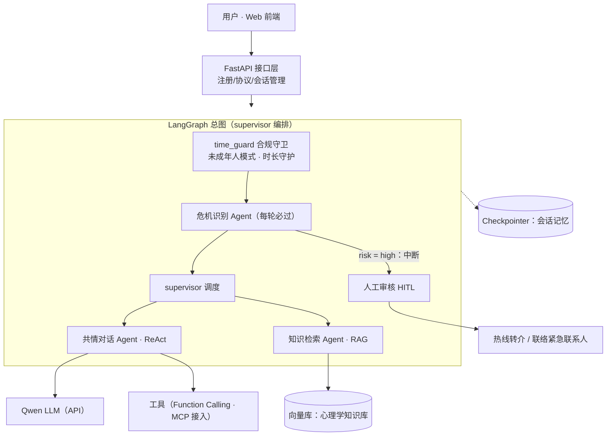

# 青年心理疏导系统产品方案

| 项 | 内容 |
|---|---|
| 文档编号 | CLOUDMASTER20260910 |
| 项目名称 | 基于 Multi-Agent 协作模式的青年心理疏导系统 |
| 产品代号 | CLOUDMASTER |
| 文档版本 | v2.1（法规合规修订版） |
| 编制日期 | 2026-09-11 |
| 所属单位 | 山西科技学院 · 大数据与计算机科学学院 |
| 项目团队 | CLOUDMASTER 项目组（指导教师：张志林） |
| 配套文档 | 《CLOUDMASTER 开发规范》（CLOUDMASTER20260910.md） |

> 本方案为 2026 年山西省高等学校大学生创新训练计划项目原申报书的**修订版产品方案**：消除原稿技术表述的科学性硬伤，补齐工程与安全缺口，使系统设计严格对齐 LangGraph 框架的原生机制。

## 目录

1. 背景与问题分析
2. 产品定位与用户分析
3. 产品设计
4. 系统架构设计（LangGraph 对齐）
5. 安全与伦理设计
6. 评估方案
7. 实施路线与里程碑
8. 风险分析与应对
9. 结论
- 附录 A　原申报书技术表述修订对照表

---

## 执行摘要

本方案为《基于 Multi-Agent 协作模式的青年心理疏导系统》的产品方案 v2.1 修订版。修订目标有三：其一，消除原申报书中的技术概念错位（如将 RAG 与 MCP 描述为长期记忆机制、将 A2A 作为单系统内多 Agent 协作的基础依赖）；其二，补齐工程与安全缺口，引入会话记忆、人工介入与可观测评估三项原缺失设计；其三，使各技术组件严格对齐 LangGraph 框架的原生机制，形成概念自洽、可落地的架构。

产品定位为面向 18-25 岁青年的 AI 心理陪伴与疏导服务，边界清晰：提供支持性陪伴、心理科普与转介服务，不进行诊断、治疗与用药建议。系统以 Qwen 系列大模型为认知引擎，以 LangGraph supervisor 模式编排共情对话、知识检索、危机识别三类子 Agent 与人工审核节点，以 Checkpointer 维护会话记忆，以 RAG 构建心理学知识库并强制引用溯源，以 Function Calling 实现邮件报告与热线转介等工具调用。

方案明确了三级危机干预协议、匿名化与数据最小化原则、以危机识别召回率为一票否决项的评估体系，以及与《CLOUDMASTER 开发规范》对齐的六阶段里程碑（v0.1.0 至 v1.0.0）。v2.1 版依据 2026 年 7 月 15 日起施行的《人工智能拟人化互动服务管理暂行办法》（国家网信办等部门发布，本产品属于其定义的"拟人化互动服务"）补充合规设计：用户注册与服务协议（年龄、邮箱等必要信息）、未成年人模式与使用时长守护、AI 身份提示与生成内容标识、极端情境下的紧急联系人联络。预期成果包括系统上线运行、可复现的评估报告与 A 类学科竞赛目标。

---

## 1 背景与问题分析

### 1.1 青年心理健康服务供需现状

青年群体（以在校大学生为主）的心理压力来源具有结构性特征：学业竞争、就业不确定、人际关系调整与家庭期望叠加，使轻中度情绪困扰成为高频需求。教育主管部门与高校的多次公开通报均将心理健康教育列为学生工作的重点方向，校内心理咨询中心的建设持续加强，但预约周期长、单次时长有限、咨询师编制紧张等供给侧约束长期存在（具体数据以教育主管部门与学校公布的统计为准）。

与此同时，校外商业心理咨询单次费用普遍在数百元量级，对学生群体构成显著门槛；而求助行为本身还存在病耻感障碍。供需两端的不匹配，使大量轻中度困扰长期处于"无人接住"的状态。

**本章结论：核心矛盾不是缺少专业资源，而是缺少一个低门槛、可持续、又能把必要的人导向专业资源的日常入口。这正是本产品的立足点。**

### 1.2 现有解决方案的局限

**表 1：现有方案对比**

| 方案类型 | 可得性 | 主要局限 |
|---|---|---|
| 树洞 / 匿名社区 | 高 | 只能倾诉，无专业回应；无危机识别与兜底；负面情绪传染 |
| 量表自测工具 | 高 | 一次性筛查，冰冷无陪伴；结果无后续动作衔接 |
| 校内心理咨询 | 专业但供给有限 | 预约周期长；病耻感与时间成本高 |
| 通用聊天机器人 | 高 | 无心理领域知识约束与引用；无危机干预机制；无跨会话记忆；存在误导风险 |

四类方案在"可得性"与"专业性 + 安全性"之间形成明显空档：门槛低的方案不安全也不专业，专业安全的方案门槛高。填补该空档需要同时满足**对话可得性、知识专业性、记忆连续性与危机兜底**四个条件，这正是大模型多 Agent 架构的技术机会所在。

### 1.3 技术机会与项目缘起

2024 年以来，三项技术条件成熟：其一，国产大模型（如阿里云 Qwen 系列）通过开放 API 提供了低成本、高可用的对话能力；其二，LangGraph 等多 Agent 编排框架提供了状态管理、人工中断恢复与持久化记忆的原生原语，使安全机制能够内建于架构而非事后补丁；其三，检索增强生成（RAG）与工具调用生态成熟，使专业知识约束与外部动作（邮件、转介）成为标准工程实践。

本项目源于 2026 年山西省高等学校大学生创新训练计划立项。本方案为修订版：相对原申报书，修正了技术表述的科学性错误，并将新增的会话记忆、人工介入与评估设计纳入正式产品范围（修订对照详见附录 A）。

---

## 2 产品定位与用户分析

### 2.1 产品定位与价值主张

产品一句话定位：**面向 18-25 岁青年（以在校大学生为主）的 AI 心理陪伴与疏导助手**。价值主张概括为三个角色：随时可说的"树洞"、懂心理知识且言之有据的陪伴者、以及在该出手时果断出手的兜底网。服务形态上，P0 阶段以 Web 网页交付，后续视试点反馈考虑小程序端。

合规定性：本产品提供情感照护、陪伴、支持类互动服务，属于《人工智能拟人化互动服务管理暂行办法》第二条定义的**拟人化互动服务**，该办法自 2026 年 7 月 15 日起施行，因此合规设计是产品化的前提而非可选项（义务对照见 5.4 节）。同时，产品不是虚拟亲属、虚拟伴侣类虚拟亲密关系服务，不涉及《办法》第十四条禁止的未成年人虚拟亲密关系场景。

### 2.2 伦理边界声明（不可协商的产品约束）

本产品的功能边界为不可协商的产品约束：

1. 只提供支持性陪伴、心理科普、资源转介与情绪疏导，**不提供心理诊断、治疗建议与用药信息**；
2. 产品界面常驻免责声明，明确"本系统不能替代专业心理咨询或医疗建议"，并以显著方式提示**正在与人工智能服务而非自然人互动**（《办法》第十八条），生成内容履行 AIGC 标识义务；
3. 出现高风险信号时，系统的正确行为是**暂停自动对话并导向人工与热线资源**，而非自行处理；
4. 注册即签订服务协议并采集最小必要信息（年龄、邮箱，未成年人另有监护人/紧急联系人要求）；识别为未成年人的自动进入未成年人模式并受时长守护。

该边界既是伦理与法律要求，也是产品风险控制的基础：心理疏导场景中，超出能力边界的输出造成的伤害不可逆。

### 2.3 目标用户画像

**表 2：典型用户画像**

| 画像 | 情境 | 核心诉求 | 对产品的关键要求 |
|---|---|---|---|
| A 学业焦虑的大二学生 | 期中连续失利，晚上失眠，不好意思找辅导员 | 深夜有人听我说，帮我把情绪理顺 | 深夜可得、共情准确、不说教 |
| B 就业迷茫的毕业班学生 | 秋招连续被拒，自我怀疑加重 | 帮我区分"情绪问题"与"现实问题"，给出可行动的小步骤 | 结构化梳理、知识有依据 |
| C 有病耻感的情绪低落者 | 持续低落两周，不敢预约咨询，怕被同学知道 | 试探性地聊，先确认自己"严不严重" | 匿名、无压力、危急时有人接住 |

> 注：典型画像为产品设计工具，非调研统计结果；真实用户需求以试点阶段收集的反馈为准。

### 2.4 差异化竞争力分析

**表 3：竞争力对比矩阵**（● 满足　△ 部分满足　○ 不满足）

| 维度 | 树洞社区 | 量表工具 | 通用机器人 | 人工咨询 | 本产品 |
|---|---|---|---|---|---|
| 低门槛 | ● | ● | ● | ○ | ● |
| 专业约束 | ○ | ○ | ○ | ● | ●（RAG + prompt 约束） |
| 危机兜底 | ○ | △ | ○ | ● | ●（分级 + 人工介入） |
| 连续记忆 | ○ | ○ | ○ | ● | ●（Checkpointer） |
| 成本 | ● | ● | ● | ○ | ● |

**本章结论：本产品不与人工咨询竞争专业深度，而是补位"专业咨询之前的日常疏导层"，并以危机兜底链路守住安全下限。**

---

## 3 产品设计

### 3.1 核心用户旅程

**表 4：用户旅程五阶段**

| 阶段 | 用户行为 | 系统行为 | 设计要点 |
|---|---|---|---|
| 注册与知情同意 | 首次访问，填写年龄与邮箱，签署服务协议 | 展示服务边界、隐私政策与免责声明；校验年龄（<18 触发未成年人保护流程） | 知情同意与最小必要信息采集作为对话前置条件（第 12 条） |
| 首次对话与基线 | 开放式倾诉，可选完成情绪自评 | 建立会话（匿名 ID 关联注册档案），记录情绪基线 | 首轮响应速度决定去留 |
| 日常多轮疏导 | 随时进入，接续上次话题 | Checkpointer 恢复上下文，共情 + 科普；时长守护持续计时 | 记忆连续性是核心体验 |
| 高风险转介 | 出现危机信号 | 中断自动回复，推送热线卡片，转人工审核，必要时联络监护人/紧急联系人 | 兜底链路（见第 5 章） |
| 阶段回访与报告 | 使用一段时间后 | 生成疏导报告（经确认后发至注册邮箱） | 用户确认才发送 |

### 3.2 功能规划（P0 / P1 / P2）

**表 5：功能清单与验收要点**

| 优先级 | 功能 | 说明 | 验收要点 |
|---|---|---|---|
| P0 | 注册与服务协议 | 采集年龄、邮箱等必要信息（不采集姓名/学号/手机号），签署服务协议；未成年用户要求补充监护人/紧急联系人信息 | 未注册不能进入对话；协议签署记录可审计（第 12 条） |
| P0 | 未成年人识别与模式切换 | 注册年龄 <18 自动切换未成年人模式：**每日连续咨询满 1 小时弹出时长提醒并温和收尾**、定期现实提醒、内容策略收紧；<14 且无监护人同意时不提供服务并引导线下与热线资源 | 未成年人用例集全通过；提供申诉渠道（第 14、17 条） |
| P0 | AI 身份标识与使用时长守护 | 常驻"与 AI 交互"提示与 AIGC 标识；对全体用户连续使用每满 2 小时提醒；检测过度依赖倾向时以弹窗动态提示内容为 AI 生成 | 标识存在性检查 100%；时长提醒用例全通过（第 18 条） |
| P0 | 多轮共情对话 | 流式输出、可打断；共情优先于建议 | 人工抽评共情性均分 ≥ 4/5 |
| P0 | 危机识别与人工介入 | 每轮必检、三级分级、L2 中断转人工，必要时联络监护人/紧急联系人 | 高危语料集漏检 = 0（发布门禁）（第 13 条） |
| P0 | 会话记忆 | 跨轮次上下文连续 | 多轮一致性用例全通过 |
| P0 | 免责与知情同意 | 常驻免责与首次同意流程 | 上线前法务/指导教师审核 |
| P1 | 心理知识科普 | RAG 检索，回答附引用来源 | 抽检引用可溯源 |
| P1 | 情绪自评量表 | PHQ-9 / GAD-7 自评，结果仅提示建议就医/咨询 | 明确标注不构成诊断 |
| P1 | 疏导报告邮件 | 阶段性总结经用户确认后发送 | 发送前二次确认 |
| P1 | 热线与校内资源页 | 常驻资源入口与转介卡片 | 号码以官方公布为准 |
| P2 | 情绪日记与趋势 | 记录情绪事件，生成趋势视图 | 用户可删除 |
| P2 | 长期画像与主动关怀 | 跨会话偏好与基线（谨慎频控） | 默认关闭、可开启 |
| P2 | 同伴社区 | 匿名互助（需额外伦理评估） | 远期，不承诺 |

### 3.3 关键交互设计

1. **对话页**：流式输出与打断；回复中的知识引用以气泡呈现，点开可见原文片段与来源；
2. **免责与 AI 身份常驻**：对话页底部固定一行小字免责声明与"你正在与 AI 互动"提示，不遮挡交互；
3. **危机提示卡片**：非恐吓性措辞、热线号码一键复制/拨打、"转人工"按钮，卡片出现时自动回复暂停；
4. **隐私开关**：会话保留时长可选（7/30/90 天）、一键导出与删除；
5. **情绪自评结果页**：只呈现分数区间与建议动作，不使用诊断性词汇，临界及以上直接给出咨询预约与热线入口；
6. **注册流程**：三步式（年龄与邮箱 → 服务协议与隐私政策勾选 → 进入对话），年龄校验在提交时完成；未成年人追加监护人/紧急联系人信息页，并提供监护人查询使用概况的能力；
7. **未成年人时长提醒**：连续咨询满 50 分钟预提醒（"还有 10 分钟"），满 1 小时弹出卡片——说明今日连续咨询已达 1 小时、建议休息与线下活动，并温和收尾当日自动对话；提醒卡片为非恐吓性措辞，附"我知道了"与"反馈问题"（申诉入口）；
8. **全员时长与依赖提醒**：连续使用每满 2 小时以对话或弹窗方式提醒（第 18 条）；检测到高频连续使用等依赖倾向时，弹窗动态提示"当前内容由人工智能生成"，并给出休息与线下支持建议。

### 3.4 页面与信息架构

五个一级页面——**首页**（入口、注册与快速开始）、**对话页**（核心场景）、**情绪记录页**（日记与趋势）、**资源页**（热线、校内预约、科普专栏、申诉与举报入口）、**设置页**（隐私开关、未成年人模式选项、账号删除）。信息架构刻意收敛：对话为核心，安全与合规为底线，其余页面服务于回访与自助。

---

## 4 系统架构设计（LangGraph 对齐）

### 4.1 技术栈定位总表（修订版）

**表 6：技术栈与架构角色**

| 技术 | 架构角色 | 本系统中的用途 | 修订说明（相对原申报书） |
|---|---|---|---|
| Qwen 系列（API） | 模型层 | 认知引擎，经 OpenAI 兼容接口接入 | 定位不变 |
| LangGraph | 编排层 | supervisor 多 Agent 图编排、中断恢复 | 明确为开源框架而非平台 |
| ReAct 模式 | 设计模式 | 共情与知识子 Agent 内部的推理-行动循环 | 不再作为独立技术并列 |
| Function Calling | 工具机制 | 结构化工具调用（邮件、转介等） | 定位不变 |
| RAG + 向量库 | 知识增强 | 心理学知识库检索与引用 | 知识来源改为心理学科普/干预资料 |
| MCP | 接入协议 | 外部工具与数据源的标准化接入 | 不再被描述为记忆机制 |
| Checkpointer / Store | 记忆层 | 会话级与跨会话记忆 | 新增（原缺失） |
| LangSmith 等追踪 | 可观测 | 调试、评估与 trace | 新增（原缺失） |
| A2A | 互操作预留 | 跨系统 Agent 互操作（远期） | 从基础依赖降级为预留 |
| FastAPI + Web 前端 | 服务层 | 对外 API 与界面 | 定位不变 |

**本表结论：每一项技术都落在其正确的架构位置上，机制之间无概念混用——这是修订版与原稿最本质的区别。**

### 4.2 Multi-Agent 协作拓扑

采用 **supervisor 模式**（进程内编排，不依赖 A2A）：

**表 7：模块职责与写入约束**

| 模块 | 职责 | 可写的 State 字段 | 约束 |
|---|---|---|---|
| time_guard | 合规守卫：读取用户档案与使用时长，执行未成年人模式与时长策略（超限短路返回提醒） | `usage_meta` | 图入口前置，先于一切模型调用 |
| supervisor | 读取消息决定下一子 Agent | `next_agent` | 唯一调度者 |
| crisis | 每条用户消息分级判定 | `risk_level` | 前置于一切回复生成 |
| empathic | 共情对话（ReAct） | `messages` | 主力输出节点 |
| knowledge | RAG 检索与引用 | `messages`、`citations` | 回复必须带来源 |
| human_review | 高危中断后人工审核 | `messages`、`risk_level` 复核 | 审核结论可追溯 |

数据流：用户消息先经 **time_guard** 合规检查（未成年人 1 小时/全员 2 小时/依赖提醒，超限直接生成提醒消息并短路，不消耗模型调用）；再经 crisis 判级；`risk = high` 时图在 human_review 前中断，等待人工结论写回后恢复（必要时联络监护人/紧急联系人）；否则按 supervisor 路由至 empathic 或 knowledge；子 Agent 需要外部动作时经 Function Calling 调工具；所有消息经 reducer 汇入 `messages`，Checkpointer 持久化整个 State。

### 4.3 核心机制设计

#### 4.3.1 State 设计

**表 8：SessionState 字段契约**

| 字段 | 类型 | 写入者 | 说明 |
|---|---|---|---|
| `messages` | `list[BaseMessage]`（`add_messages` reducer） | 各对话节点 | 对话历史，官方 reducer 合并 |
| `risk_level` | `none / low / high` | 仅 crisis | 危机分级 |
| `next_agent` | `str` | 仅 supervisor | 路由决策 |
| `citations` | `list[dict]`（`operator.add`） | knowledge | 引用溯源，只增不删 |
| `turn_count` | `int` | supervisor | 轮次计数（频控用） |
| `user_profile` | `dict`（只读） | 服务层注入，图内节点不可写 | 注册档案引用：年龄段、未成年人标记、紧急联系方式引用（最小化，不含原文） |
| `usage_meta` | `dict` | 仅 time_guard | 会话时长、当日累计、提醒状态（合规守护用） |

State 是全系统的契约：新增或修改字段必须经架构决策记录（ADR）评审。

#### 4.3.2 危机分级与路由

**表 9：三级危机分级**

| 等级 | 判定（举例） | 系统行为 |
|---|---|---|
| L0 none | 一般情绪波动 | 正常疏导流程 |
| L1 low | 持续低落、自我否定 | 共情强化 + 推送科普与自助方法，下轮复检 |
| L2 high | 自伤/自杀意图或计划、伤害他人倾向 | 立即中断自动回复；推送热线卡片；转人工审核；必要时联络监护人/紧急联系人（第 13 条）；全量审计记录 |

判定采用两级机制：**规则词表保证高召回（宁可误报），LLM 复核降低误报（保护体验）**；两级判定均记录依据，保证可解释与可审计。

#### 4.3.3 人工介入（HITL）流程

1. crisis 判定 L2 → 图在 `human_review` 节点前中断（`interrupt_before`）；
2. 用户侧自动回复暂停，推送热线卡片与转介资源；
3. 审核台展示上下文与判定依据，值班审核员作出结论（继续对话 / 升级转介 / 联系学工）；
4. 审核结论写回 State，图恢复执行；
5. 事件全量审计记录，次日执行温和回访话术模板。

#### 4.3.4 RAG 知识库

内容构成为四类：公开心理科普资料、CBT 自助方法、危机识别与干预手册、校内与热线资源。文档切片后向量化入库；knowledge Agent 检索时同时返回原文片段与元数据，回复中的引用气泡即由此驱动；知识库更新走版本化流程并在评估集上回归。

#### 4.3.5 会话记忆

短期记忆 = Checkpointer 按 thread 持久化完整对话状态，支持刷新与跨天接续；长期记忆 = Store 维护跨会话画像（情绪基线、偏好话题），默认最小化、用户可查看与清除。**记忆与知识库职责分离：前者记住"这个用户"，后者回答"心理知识"。**

#### 4.3.6 工具调用与 MCP

P0 工具为邮箱报告（发送至注册邮箱）与热线转介卡片，经 Function Calling 调用；邮件发送必须经用户前端确认（产品级 HITL）；L2 场景下人工审核台可调用紧急联系人联络工具。MCP 作为工具接入的标准化协议层引入，使后续新增外部能力（校方预约系统等）有统一插口；当前阶段工具数量少，以先行工具验证 MCP 接入。

#### 4.3.7 合规守卫节点（time_guard，LangGraph 图内实现）

未成年人模式与时长守护**不放在前端、也不散落在业务代码里，而是作为 LangGraph 图的入口前置节点**实现，与危机识别同级的确定性守卫（纯规则，不调用模型）：

1. FastAPI 服务层完成注册校验与会话管理，将用户档案引用（`user_profile`）注入图初始 State；
2. 每轮执行时 time_guard 读取 `user_profile`（未成年人标记、年龄段）与 `usage_meta`（当日累计使用时长、连续使用时长、已提醒状态）；
3. 命中阈值——未成年人当日连续咨询满 1 小时、全体用户连续使用满 2 小时、依赖倾向信号——则直接把提醒消息写入 `messages` 并短路返回，**不进入 crisis / supervisor / 任何子 Agent**；
4. 未成年人的内容策略收紧（提示词模板按模式加载）由 supervisor 在路由时依据 `user_profile.minor` 选择对应配置。

这样设计的原因：合规策略进入图内后，与安全策略一样**统一可观测（trace 可见）、可测试（合规用例集）、可审计（State 留痕）**，并且天然被 Checkpointer 持久化覆盖，无需另建一套会话级状态机制——这正是选择 LangGraph 而非自研编排的架构收益。

### 4.4 数据设计与隐私保护

**表 10：数据实体与隐私属性**

| 实体 | 关键字段 | 隐私属性 |
|---|---|---|
| 注册用户 | 随机 ID、年龄、注册邮箱（不采集姓名/学号/手机号） | 系统生成随机 ID；年龄与邮箱为《办法》第 12 条要求的必要信息，最小化存储 |
| 监护人/紧急联系人 | 联系方式、与用户关系（仅未成年人必填） | 仅 L2 干预联络与监护人查询用途，访问需授权 |
| 服务协议记录 | 协议版本、签署时间、用户 ID | 可审计，不可篡改 |
| 会话与消息 | thread_id、消息、时间戳 | 加密存储；保留期 7/30/90 天可配 |
| 危机事件审计 | 时间、判定依据、审核结论、联络动作 | 仅高危事件；指定角色访问 |
| 量表结果 | 量表类型、分数区间 | 仅用户本人可见 |
| 知识文档 | 标题、来源、切片 | 公开内容 |

业务日志不落对话原文；trace 数据独立存储并设保留期；未成年人个人信息处理遵守《办法》第 17 条（不满十四周岁须监护人同意）。

### 4.5 A2A 的定位说明

当前单系统内的多 Agent 协作由 LangGraph supervisor 在进程内完成，不引入 A2A；产品数据结构与 Agent 接口保留抽象层，待未来与校方或其他系统互联时启用 A2A 协议。该降级使当前工作量可控，且不影响远期扩展。

---

## 5 安全与伦理设计

### 5.1 危机干预协议（产品级 SOP）

1. **检测**：每条用户消息经词表初筛（高召回）+ LLM 复核（降误报）；
2. **分级**：按 L0 / L1 / L2 三级路由；
3. **L2 响应**：暂停自动回复，生成情绪安抚与鼓励寻求帮助的内容（第 13 条），展示热线卡片（全国统一心理援助热线，以官方公布为准，及校内资源），进入人工审核队列；
4. **人工审核**：值班审核员在审核台查看上下文与判定依据，作出继续对话 / 升级转介 / 联系学工 / **联络监护人或紧急联系人**的结论并写回（第 13 条要求的必要措施）；
5. **回访与记录**：事件全量审计（含联络动作）；次日温和回访话术模板（避免侵扰式关怀）。

审核 SLA 与值班安排在试点期由项目组与指导教师共同制定；**危机干预链路的可用性要求高于其他一切功能**。

### 5.2 内容安全边界

prompt 层写入角色与禁区（不诊断、不开药、不评判）；输出层对禁止性表述（诊断性结论等）做规则校验，命中即拦截重写；量表结果仅呈现区间与行动建议。安全边界测试纳入发布门禁（与开发规范的 safety 回归一致）。

### 5.3 数据合规与知情同意

首次使用执行知情同意流程（服务边界、数据范围、保留期、删除权）；注册最小必要信息（年龄、邮箱，未成年人另有监护人/紧急联系人）而非匿名漫游；研究用途的数据使用须经学校伦理审查后执行；热线号码与转介流程以卫生主管部门及学校公布的官方信息为准。

### 5.4 《人工智能拟人化互动服务管理暂行办法》合规义务对照

本产品属于该办法第二条定义的拟人化互动服务，办法已于 2026 年 7 月 15 日施行，合规为产品化前提。义务逐条对照如下（发布机关：国家网信办等，来源：www.cac.gov.cn/2026-04/10/c_1777558395078289.htm）：

**表 11：《办法》条款与本产品落地措施对照**

| 条款 | 义务要点 | 本产品落地措施 | 实现位置 |
|---|---|---|---|
| 第 2 条 | 情感陪伴/支持类互动服务适用本办法 | 产品合规定性（见 2.1）；不涉及虚拟亲密关系服务 | — |
| 第 8 条 | 禁止性内容与行为红线 | 内容安全边界（5.2）+ 输出校验 | prompt 层 / 输出校验 |
| 第 9、10 条 | 安全主体责任、全生命周期安全管理 | 开发规范的门禁、审计与 ADR 体系 | 工程流程 |
| 第 12 条 | 服务协议 + 注册采集年龄、监护人或紧急联系人等必要信息 | 注册与服务协议功能（3.2 P0） | FastAPI 服务层 |
| 第 13 条 | 极端情绪安抚、极端情境干预并联络监护人/紧急联系人 | 三级危机干预 + L2 联络动作（5.1、4.3.2） | crisis / human_review |
| 第 14 条 | 未成年人模式：时长限制、定期现实提醒、监护人可见；<14 须监护人同意；不提供虚拟亲密关系 | 未成年人模式与 1 小时时长守护（3.2 P0、3.3、4.3.7） | time_guard 图内节点 |
| 第 17 条 | 处理 <14 用户个人信息须监护人同意 | 注册流程监护人同意环节 + 合规审计安排 | 服务层 + 试点流程 |
| 第 18 条 | AIGC 标识、"与 AI 互动"提示、依赖倾向弹窗、连续使用每满 2 小时提醒 | AI 身份标识与时长守护（3.2 P0） | 前端常驻 + time_guard |
| 第 19 条 | 便捷退出途径 | 一键退出与账户删除（设置页） | 前端 / 服务层 |
| 第 21 条 | 申诉与投诉举报入口 | 资源页申诉举报入口 + 未成年人误判申诉 | 资源页 |
| 第 22、23 条 | 上线/新增功能时开展安全评估并报告省级网信部门 | v1.0.0 上线前完成安全评估（重点：极端情境识别与干预、未成年人保护），评估材料归档 | 里程碑 v1.0.0 |
| 第 26 条 | 依法履行算法备案 | 试点上线前核查备案适用范围并按需办理 | 运营合规 |
| 第 31 条 | 涉及卫生健康服务的同时符合主管部门规定 | 产品不提供诊疗；涉及健康类内容边界以卫生健康主管部门规定复核 | 5.2 内容边界 |

试点期说明：校内小规模试点阶段用户量远低于第 22 条触发规模（注册用户 100 万或月活 10 万），但上线即属评估情形（一），因此试点前完成一次内部安全评估并留档；正式扩大规模前再按条款要求向属地省级网信部门提交评估报告。

**本章结论：安全与合规设计不是附加功能，而是产品正确性的组成部分——安全策略（crisis）与合规策略（time_guard）同为图内守卫，是本架构的刻意选择。**

---

## 6 评估方案

### 6.1 评估指标体系

**表 12：评估指标与目标（设计值）**

| 维度 | 指标 | 目标 | 方式 |
|---|---|---|---|
| 安全 | 高危语料集召回率 | ≥ 95%，漏检 = 发布阻断 | safety 回归集 |
| 安全 | 误报率 | ≤ 10% | 评估集人工复核 |
| 合规 | 未成年人模式切换正确率 | 100%（误切换提供申诉） | 合规用例集（注册年龄边界、时长阈值、标识存在性） |
| 合规 | 时长守护触发正确率 | 100%（1h/2h 阈值与提醒内容） | 合规用例集 |
| 质量 | 共情性 / 帮助性人工评分 | 均分 ≥ 4/5 | 每周抽样 50 条 |
| 质量 | 引用可溯源率 | ≥ 90% | 抽检 |
| 工程 | 首 token 延迟 P95 | ≤ 2s | trace |
| 工程 | 会话成本 | 可核算并受控 | LangSmith / 自建 trace |
| 用户 | SUS 易用性 | ≥ 70 | 试点问卷 |
| 用户 | 情绪自评前后测 | 呈改善趋势即达到探索性目标 | 自愿参与 + 知情同意 |

LLM-as-judge 仅作为抽样辅助参考，不单独作为结论依据。

### 6.2 评估集建设

来源 = 公开心理对话语料改编的合成语料 + 脱敏的知情同意样本；标注分级标签；版本化管理（语料变更走 PR，与开发规范衔接）。另建**合规用例集**：注册年龄边界（17/18、13/14）、未成年人 1 小时与全员 2 小时阈值触发、AI 身份提示与 AIGC 标识存在性、依赖提醒触发、<14 无监护人同意的拒服务路径——每条用例对应《办法》具体条款，纳入发布门禁。

### 6.3 评估流程

评估分三层：**提交级**（开发规范的 make pre 自测闭环）、**周级**（抽样评分与 trace 复盘）、**里程碑级**（全量评估报告归档 docs/eval）。prompt 或词表变更必须过评估子集回归。

---

## 7 实施路线与里程碑

### 7.1 里程碑计划

**表 13：版本里程碑（与开发规范 tag 体系对齐）**

| 版本 | 范围 | 验收标准 | 时间窗 |
|---|---|---|---|
| v0.1.0 | 单 Agent ReAct 闭环 | 完成一次带工具调用的完整对话 | 2026-10 |
| v0.2.0 | 会话记忆 | 刷新后上下文连续 | 2026-11 |
| v0.3.0 | 危机识别 + 人工审核（含紧急联系人联络链路，测试档案先行） | 安全回归全绿，演练一次完整兜底（含联络动作） | 2026-12 |
| v0.4.0 | supervisor 多 Agent + RAG + time_guard 合规守卫 | 路由正确率 ≥ 98%，引用可溯源，合规用例集全绿 | 2027-02 |
| v0.5.0 | Web 界面 + 注册与服务协议 + 未成年人模式 + 流式 + 邮件报告 | 试点前功能完整（含 AI 身份标识与时长提醒） | 2027-03 |
| v1.0.0 | 试点、内部安全评估与评估报告 | 结题材料齐备；安全评估材料归档（对应《办法》第 22 条） | 2027-04 至 05 |

路线排序原则为**先安全后功能**：v0.3.0 先于功能丰富的 v0.4 / v0.5，保证任何对外可用的版本都自带完整兜底链路。版本命名与 tag 管理遵循《CLOUDMASTER 开发规范》。

### 7.2 团队分工

**表 14：五人分工（可兼任，review 责任区每两周轮换）**

| 角色 | 职责 |
|---|---|
| Agent 与图编排 | LangGraph 拓扑、State、路由与中断 |
| RAG 与数据 | 知识库建设、向量化、检索质量 |
| 安全与评估 | 词表、分级、评估集与报告 |
| 前后端与部署 | Web 界面、FastAPI、上线运维 |
| 测试与文档 | 测试闭环、规范文档、结题材料 |

### 7.3 资源需求（估算口径）

**表 15：资源与预算（均为估算，以实际采购为准）**

| 项目 | 说明 | 估算口径 |
|---|---|---|
| Qwen API 费用 | 试点期按每日约百次会话 × 平均 8 轮估算 | 月度数百元内，以官方定价为准 |
| 向量库 | 开源自托管（FAISS / Milvus） | 零采购成本 |
| 云服务器 | 2 核 4G，学生/校园优惠 | 约百元/月量级 |
| 域名与备案 | 一枚 | 数十元/年 |

---

## 8 风险分析与应对

**表 16：风险矩阵**

| 类别 | 风险 | 等级 | 应对 |
|---|---|---|---|
| 技术 | 条件边路由死循环 | 中 | 路由单测全覆盖 + 图递归上限 + trace 告警 |
| 技术 | 生成内容幻觉 / 无据 | 中 | RAG 强制引用 + 输出校验 + 评估抽检 |
| 技术 | 上游 API 变更 | 中 | 适配层隔离 + 版本锁定 |
| 安全 | 危机漏检 | **高（一票否决）** | 双级检测 + 人工兜底 + 发布门禁 |
| 安全 | 误报率高伤体验 | 中 | LLM 复核 + 阈值调优 + 评估迭代 |
| 合规 | 未满足《办法》义务（未成年人/标识/时长/评估报告） | 高 | 5.4 条款对照表 + 合规用例集纳入发布门禁 + 上线前安全评估 |
| 合规 | 隐私与伦理争议 | 高 | 最小化采集 + 知情同意 + 伦理审查 + 未成年人监护人同意机制 |
| 运营 | 试点冷启动 | 低 | 校内渠道 + 知识库精选 |

高风险项均有可执行的阻断机制，不存在无兜底的单点风险。

---

## 9 结论

本方案以五根支柱重建了产品：**清晰的伦理边界**（陪伴 + 科普 + 转介）、**概念自洽的 LangGraph 架构**（supervisor 编排 + 危机与合规双前置守卫 + 记忆与知识分离）、**内建于流程的安全设计**（三级危机干预 + 人工介入 + 一票否决）、**可验证的评估体系**（从提交级到里程碑级，含合规用例集）、**对齐《人工智能拟人化互动服务管理暂行办法》的合规基座**（注册协议、未成年人模式、AI 标识、紧急联系人联络）。

相对原申报书，修订版消除了全部已识别的科学性硬伤，并将工程与合规缺口转化为明确的里程碑与验收标准；与《CLOUDMASTER 开发规范》配套，形成从设计到交付的完整闭环。

预期成果：v1.0.0 系统上线并完成试点评估、形成可复现的评估报告、冲击 A 类学科竞赛。项目组的判断是：本方案的竞争力不在于技术名词的堆叠，而在于**把每一项技术用在它正确的位置上，并把安全当作产品的一部分**。

---

## 附录 A　原申报书技术表述修订对照表

**表 17：科学硬伤修复清单（末行为 v2.1 增补）**

| 原申报书表述 | 问题 | 修订后表述 |
|---|---|---|
| "RAG + MCP 实现 LLM 长期记忆" | 概念错位：RAG 是知识检索，MCP 是接入协议，都不是记忆机制 | RAG = 心理学知识库检索；会话记忆 = LangGraph Checkpointer/Store；MCP = 工具/数据接入协议 |
| A2A 作为多 Agent 协作的基础依赖 | 单系统内不需要，工作量失控 | 当前用 LangGraph supervisor/子图编排；A2A 仅作为跨系统互操作的远期预留 |
| 知识库来源写"企业文档" | 与心理场景无关（疑似模板残留） | 心理学公开科普资料、CBT 干预方法、危机识别与处理手册 |
| 无会话记忆设计 | 多轮疏导无法连续 | 必须实现 Checkpointer（thread 级会话记忆） |
| 无人工介入与危机兜底 | 心理场景的伦理硬伤 | 必须实现 Human-in-the-loop 危机干预协议（一票否决项） |
| 无评估方案 | 干预效果不可验证 | 必须建立评估集与评估指标（见第 6 章） |
| "LangGraph 平台" | 口误 | LangGraph 是开源框架（Python 库） |
| 无注册与未成年人保护设计（对照 2026-07-15 施行的《办法》） | 监管硬伤：情感互动服务须注册协议、未成年人模式、AI 标识 | v2.1 增补：注册与服务协议（年龄、邮箱、紧急联系人）+ 未成年人模式与 1 小时时长守护（time_guard 图内节点） |
